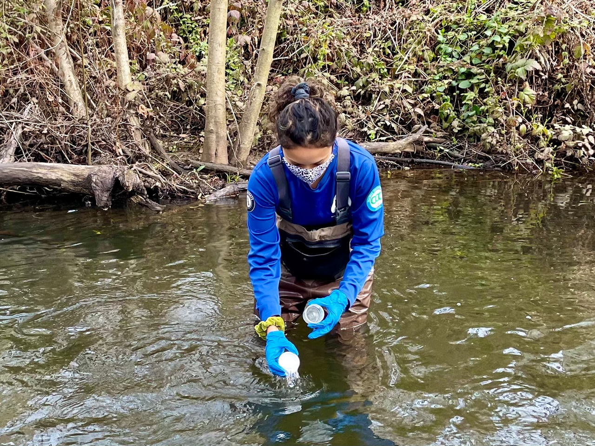

```{r setup, include=FALSE}
knitr::opts_chunk$set(echo = FALSE)
```


In my most recent job I worked at Point Reyes National Seashore and Golden Gate National Recreation Area monitoring coho salmon and steelhead trout. In this photo, I am taking a sample for water quality measurements. 


In my free time, I enjoy scuba diving and have my PADI Advanced Open Water Certification. 


Here's me and my family in Illigan City, Philippines. 